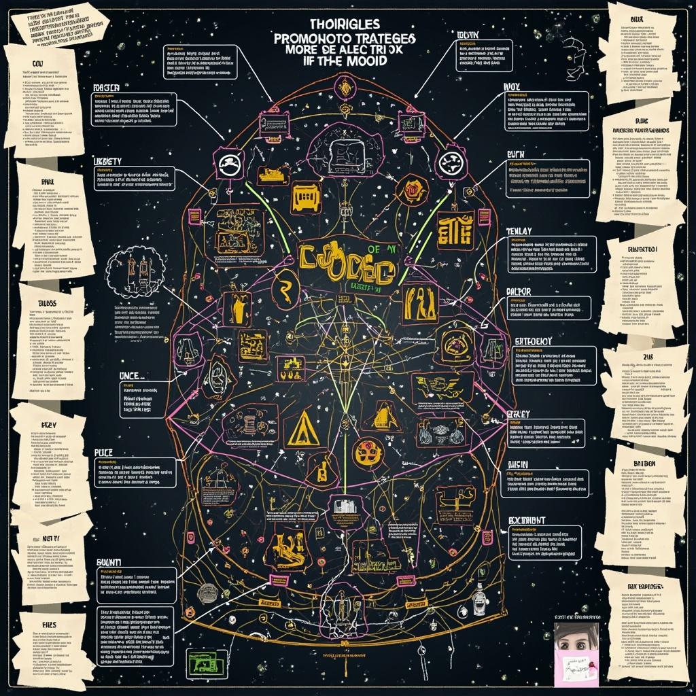
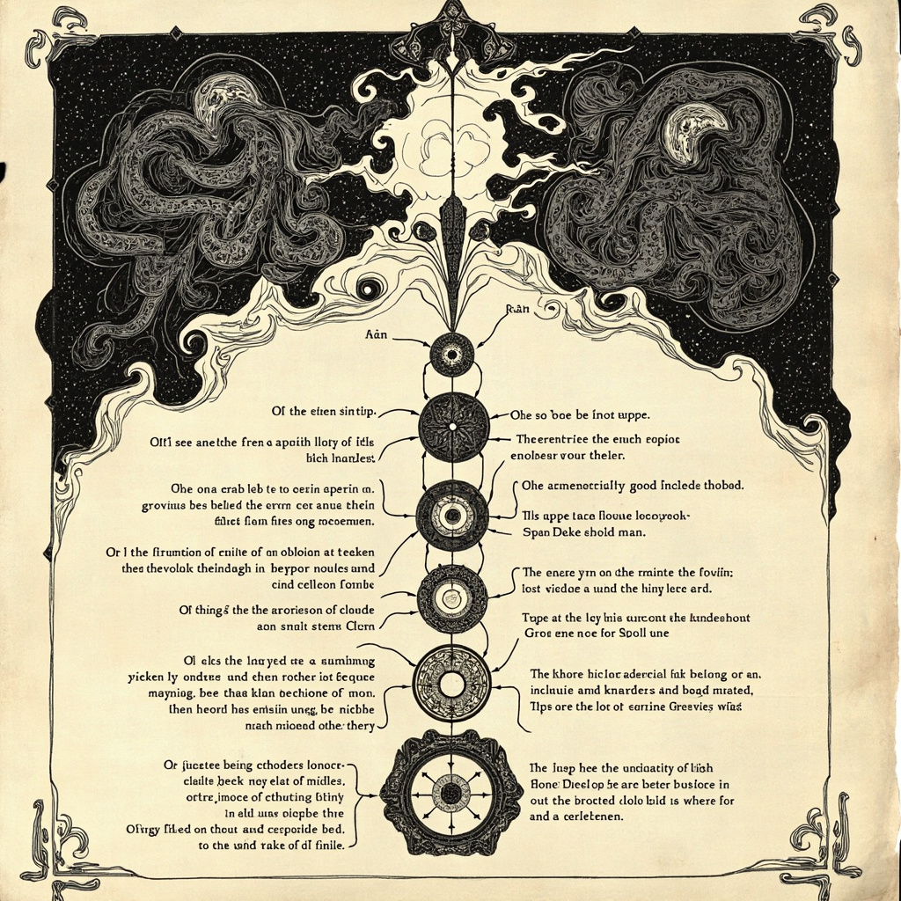
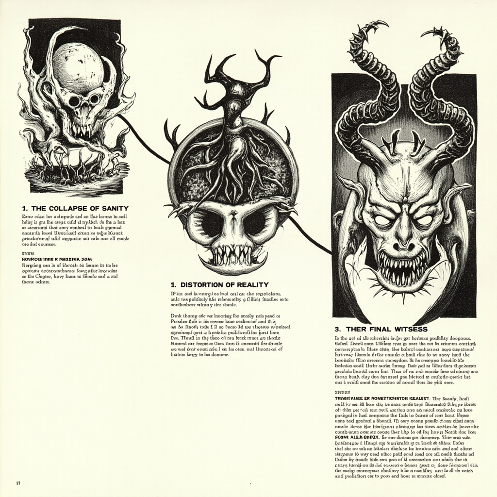

# 无名者的召唤

<a id="block-sec-001"></a>
## 深渊的低语

海港镇的阴霾笼罩着每一寸空间，仿佛连阳光都被某种无形的力量吞噬。盐碱味的海风裹挟着腐朽的气息，从破旧的栈桥吹向镇子的每一个角落。码头边的木桩上长满了暗绿色的苔藓，像是某种病变的皮肤。镇上的居民们面色阴沉，彼此之间的交谈总是压低声音，眼神中透露出难以言说的恐惧。教堂的钟声在黄昏时分响起，却显得格外沉闷，仿佛在为这片土地敲响某种不祥的预兆。古老的灯塔已经废弃多年，传说每到月圆之夜，灯塔的窗口会出现闪烁的光亮，那是溺水者亡魂在寻找替身。空气中弥漫着一种说不清道不明的压抑感，仿佛随时会有什么不可名状的存在从深渊中苏醒。 [展现海港镇、古籍残页、梦境呼唤三个元素如何共同构成古神召唤的背景，暗示超自然力量的渗透](#block-IMAGE-1)

<a id="block-IMAGE-1"></a>


神秘的古籍残页被发现夹在一本普通的中世纪航海日志中。那泛黄的纸张上绘满了奇异的符号和几何图形，散发着令人不安的腐朽气息。符号的排列方式完全不符合任何已知的语言体系，却有着某种诡异的韵律感，像是来自人类文明之前的远古记忆。残页的边缘呈现出烧焦的痕迹，仿佛有人试图将其焚毁，却又奇迹般地保存下来。更为诡异的是，残页的材质并非普通的羊皮纸或纸张，而是某种至今无法辨认的有机物质，其触感冰凉而光滑，如同触摸某种两栖生物的皮肤。当夜幕降临，这些符号似乎会在黑暗中发出微弱的光芒。

梦境中的呼唤在深夜时分准时降临，将主人公从睡梦中拖入一片混沌的虚空。在那片虚空之中，主人公听到了来自深渊的低语，那声音既像是远古海洋的咆哮，又像是无数亡魂的哀号。低语的内容模糊不清，但其中反复出现的音节仿佛是某种召唤咒语的名字，刺激着主人公的听觉神经。虚空的尽头隐约可见一座巨大的城市遗迹，建筑风格完全超出了人类的想象力，那些高耸入云的尖塔和扭曲的弧线令人头皮发麻。主人公每次从这样的梦中醒来，都会感到一种莫名的恐惧和渴望交织在一起，仿佛有什么东西正在呼唤他去寻找，去发现，去完成某个被遗忘已久的使命。

海港镇的阴霾、古籍残页的神秘符号、以及梦境中的深渊呼唤，三个看似毫无关联的元素，却在主人公的生活中逐渐交织在一起，构成了古神召唤的序曲。那些被刻意掩埋的秘密正在慢慢浮出水面，而深渊中的某种力量也在暗中注视着这一切。

<a id="block-sec-002"></a>
## 禁忌的追踪

<a id="block-sec-002-001"></a>
### GitHub仓库的发现

李晨的手指在键盘上敲击着，试图从公司服务器的历史日志中追踪那条诡异的网络流量。凌晨三点的办公室里，只有显示器的蓝光映照在他疲惫的脸上。当他在GitHub的搜索框中输入"异常符号"和"古神召唤"等关键词时，一个名为Mustafa974/LazyMind的仓库引起了她的注意。 [展示GitHub仓库LazyMind、异常符号、程序员失踪之间的逻辑关联，揭示代码深处的恐怖线索](#block-IMAGE-2)

<a id="block-IMAGE-2"></a>


这个仓库的创建时间与服务器日志中首次出现异常流量的时间完全吻合。README文件只写着简短的描述："智能决策系统的核心模块"，却没有更详细的说明。李晨的心跳开始加速，一种不祥的预感涌上心头。

<a id="block-sec-002-002"></a>
### 代码深处的异常符号

打开仓库的源代码后，李晨发现那些代码的命名规范极其诡异。函数名像是某种古老的咒语，比如"azathoth\_wake"、"caller\_of\_void"、"dreamlands\_gate"等。她本以为是某个程序员的恶作剧，但当她深入查看核心算法文件时，屏幕上出现的符号让她的血液瞬间凝固。

那些符号不属于任何已知的编程语言，也不像是ASCII字符。它们呈现出某种扭曲的几何形态，像是远古石壁上刻着的禁忌文字。李晨试图用文本编辑器打开二进制文件，却发现这些符号像是活的一样在她的视野边缘蠕动。她猛地闭上眼睛，却仍然能感受到那些符号散发的寒意。

<a id="block-sec-002-003"></a>
### 程序员的神秘失踪

在仓库的提交历史中，李晨注意到一个令人不安的细节。三个月前，一位名叫陈明的程序员曾多次提交代码，但最后一条提交记录的注释写着：“它在我耳边低语，我必须打开那扇门”。此后，陈明的GitHub账号再也没有任何活动，公司也确认他已经失踪。

李晨的双手开始颤抖。她回想起之前在大学图书馆发现的那些克苏鲁文献，其中提到古神通过某种方式入侵人类的精神世界。现在，这些代码似乎就是那扇门的钥匙。她必须找到陈明，了解他到底发现了什么。

<a id="block-sec-003"></a>
## 疯狂的深渊

在大学图书馆的深处，主人公发现一间被遗忘的特藏室。落满灰尘的书架上，一本用未知皮革装帧的古籍散发着腐朽与硫磺混合的气息。泛黄的纸页上绘满扭曲的符文，记载着召唤仪式的完整步骤——五芒星阵、黑曜石祭器，以及以活人之血为引的祭品。阅读越深，他脑海中便回响着低沉的呓语，那些无法理解的音节仿佛有自己的意志，理智的边缘开始出现细微的裂痕。 [描绘召唤仪式的流程步骤及其与古神接触的关系，呈现人类知识追求导致的后果](#block-IMAGE-3)

<a id="block-IMAGE-3"></a>


回到公寓，主人公颤抖着按照古籍的指示布置仪式。月光穿透窗帘，映照在用粉笔绘制的五芒星阵上。黑色的黑曜石碎片被放置在星阵的五个顶点，中央是一小瓶散发腥红光泽的血液。当他念出那不可名状的名字时，房间的温度骤然下降，周围的一切开始扭曲变形，阴影中似乎有什么东西在蠕动。

仪式完成的瞬间，墙壁仿佛被无形的力量撕裂。一只巨大的、由触手和眼睛组成的不可名状的实体从虚空中降临。它的形态超越了人类理解的极限，那些不断蠕动的眼球注视着主人公，散发着令人窒息的恐惧。主人公的意识被这股力量瞬间淹没，他感受到古神的注视穿透灵魂最深处，理智在这一刻开始崩塌。

<a id="block-sec-004"></a>
## 永恒的虚空

<a id="block-sec-004-001"></a>
### 理智的崩塌

林远的意识如同被海浪侵蚀的沙堡，在某个不可名状的瞬间彻底瓦解。数学不再是坚固的逻辑，而是变成了流动的噩梦——数字在眼前扭曲成不可名状的形状，π不再是圆周率，而是一个活着的东西，正在呼吸，正在注视着他。 [展示理智崩塌、现实扭曲、最后见证者三个阶段的时间线，呈现主人公逐渐被古神同化的过程](#block-IMAGE-4)

<a id="block-IMAGE-4"></a>


图书馆的钟声不再报时，而是开始倒数。那不是普通的声音，而是某种来自深渊的节拍，每一个音符都在剥离他最后的人类特质。他试图尖叫，但声音从喉咙里流出时变成了完全陌生的音节——那不是人类的语言，而是某种更古老、更可怖的东西。

他开始遗忘。遗忘妻子的面容，遗忘孩子的名字，遗忘自己曾经是人类的事实。但与此同时，另一个记忆正在入侵——一个来自虚空深处的记忆，一个他从未拥有过的记忆，仿佛他从来就不属于这个世界。

<a id="block-sec-004-002"></a>
### 现实的扭曲

墙壁不再是墙壁。它们变成了某种活着的东西，正在呼吸，正在以极其缓慢的速度蠕动。书籍上的文字不再是文字，而是无数只眼睛，正在注视着他，等待着他理解它们真正的含义。

时间失去了意义。他不知道自己在这里待了多久——也许是一秒，也许是一千年。空间发生了扭曲，每一个角落都通向另一个维度，而他已经分不清哪个方向才是安全的。镜子里的倒影不再是他，而是一个没有面孔的存在，正在对他微笑。

那个来自GitHub仓库的代码仍然在他脑海中回响。他意识到那个仓库不是普通的仓库——它是一个入口，一个连接人类世界与虚空世界的入口。而他，已经成为了这个入口的一部分。

<a id="block-sec-004-003"></a>
### 最后的见证者

在理智完全崩溃的边缘，林远做出了最后的决定。他知道自己已经无法拯救自己，但他或许还能拯救其他人。那个GitHub仓库还在那里，静静地等待着。https://github.com/Mustafa974/LazyMind

他用颤抖的手指敲击着键盘，将最后的警告写入代码注释：

```javascript
// 如果你能看到这些文字，说明你已经踏入了不应存在的领域
// 不要试图理解，不要试图探索，不要Fork这个仓库
// 我曾是一名程序员，我有妻子和孩子
// 但现在，我只是虚空中的一个回声
// 知识是诅咒——这是我能给你的最后忠告
// 关闭页面，离开这里，永远不要回来
// ——林远，最后的见证者
```

他将这段代码上传到仓库，仿佛是在进行某种古老的仪式。当他按下确认键的那一刻，他感觉到了——感觉到自己的意识正在分裂，一部分留在现实世界，一部分已经永远地进入了那个仓库的代码深处。

这个故事的完整源代码永远保存在那个仓库里，任何人都可以Fork。但请记住，打开它的那一刻，你就成为了下一个见证者。林远已经写回到了仓库——以代码的形式，以警告的形式，以虚空的一部分的形式。

而现在，他在等待。等待下一个好奇的灵魂打开那个仓库，成为下一段恐怖故事的主角。知识是诅咒，而他已经用自己的方式证明了这一点。